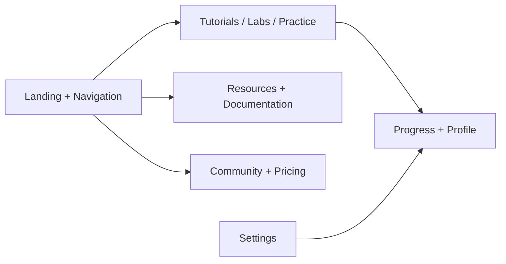
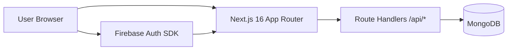

# QuantumDB

<p align="center">
  
</p>

<p align="center">
  Professional, full-stack database learning platform with tutorials, labs, practice, progress analytics, and community modules.
</p>

<p align="center">
  
  
  
  
  
  
</p>

## Overview

QuantumDB is an industry-style DBMS learning product built with the Next.js App Router.  
It combines structured content with hands-on workflows:

- Guided tutorials
- Interactive labs
- Practice challenges
- Progress tracking
- Community features
- Resources and documentation
- Account and settings management

## Product Flow



## Architecture



## Core Modules

| Module | Route | Purpose |
| --- | --- | --- |
| Home | `/` | Product overview and module entry points |
| Tutorials | `/tutorials` | Guided learning paths and filtering |
| Labs | `/labs` | Hands-on database lab workflows |
| Practice | `/practice` | Challenge-based practice system |
| Progress | `/progress` | Learning analytics and achievements |
| Resources | `/resources` | Curated technical resources |
| Documentation | `/documentation` | Reference and quick links |
| Community | `/community` | Discussions, events, members |
| Profile | `/profile` | User-specific saved items and history |
| Settings | `/settings` | Preferences, account profile, local-data controls |

## Tech Stack

| Layer | Technologies |
| --- | --- |
| Frontend | Next.js 16, React 19, TypeScript, Tailwind CSS 4, Framer Motion |
| UI System | Radix UI primitives, Lucide icons |
| Data | MongoDB, Mongoose |
| Auth | Firebase Authentication |
| SEO | Next.js Metadata API, sitemap, robots, JSON-LD |
| Tooling | ESLint, PostCSS, tsx |

## Quick Start

### 1. Prerequisites

- Node.js 18.18+ (Node 20 LTS recommended)
- npm 9+
- MongoDB (local or Atlas)
- Firebase project (for authentication features)

### 2. Install

```bash
npm install
```

### 3. Configure Environment

```bash
cp .env.local.example .env.local
```

Set at least these values in `.env.local`:

| Variable | Required | Description |
| --- | --- | --- |
| `MONGODB_URI` | Yes | MongoDB connection string |
| `ADMIN_PASSCODE` | Yes | Server-side passcode for protected write operations |
| `NEXT_PUBLIC_ADMIN_PASSCODE` | Yes | Client-side passcode prompt |
| `NEXT_PUBLIC_SITE_URL` | Recommended | Canonical URL for metadata/SEO (for production) |
| `NEXT_PUBLIC_FIREBASE_API_KEY` | Recommended | Firebase web config |
| `NEXT_PUBLIC_FIREBASE_AUTH_DOMAIN` | Recommended | Firebase web config |
| `NEXT_PUBLIC_FIREBASE_PROJECT_ID` | Recommended | Firebase web config |
| `NEXT_PUBLIC_FIREBASE_STORAGE_BUCKET` | Recommended | Firebase web config |
| `NEXT_PUBLIC_FIREBASE_MESSAGING_SENDER_ID` | Recommended | Firebase web config |
| `NEXT_PUBLIC_FIREBASE_APP_ID` | Recommended | Firebase web config |
| `NEXT_PUBLIC_FIREBASE_MEASUREMENT_ID` | Optional | Firebase analytics |

### 4. Run Development Server

```bash
npm run dev
```

Open `http://localhost:3000`.

### 5. Optional: Seed MongoDB with Sample Data

```bash
npx tsx scripts/migrate-data.ts
```

## npm Scripts

| Command | What it does |
| --- | --- |
| `npm run dev` | Run local dev server |
| `npm run build` | Build for production |
| `npm run start` | Start production server |
| `npm run lint` | Lint the project |

## Project Structure

```text
app/                Next.js App Router pages and API routes
components/         Reusable UI modules (auth, tutorials, labs, etc.)
lib/                Data access, models, hooks, context, SEO helpers
public/             Static assets (logos, icons)
scripts/            Setup and migration scripts
```

## SEO and Metadata

QuantumDB includes:

- Canonical URLs and Open Graph metadata
- Twitter card metadata
- `robots.ts` and `sitemap.ts`
- JSON-LD (`Organization`, `WebSite`)
- Branded favicon and social preview assets

## Contributing

See [CONTRIBUTING.md](CONTRIBUTING.md) for setup, coding standards, and PR flow.

## License

This project is licensed under the MIT License. See [LICENSE](LICENSE).
